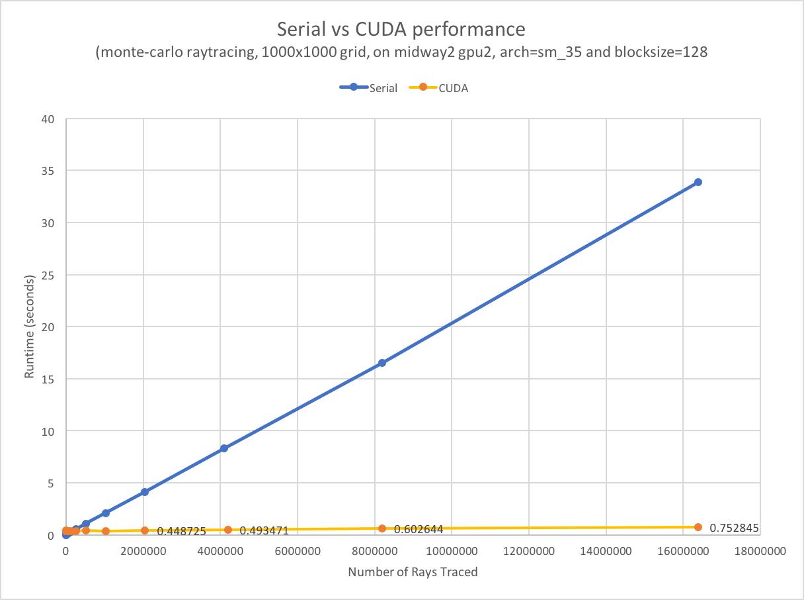
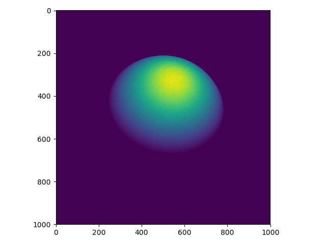

# CUDA Ray Trace Example

_Testing was performed on the Midway supercomputer at UChicago._

For a refresher (or intro) on what ray tracing is, check Wikipedia's
page on [ray tracing](https://en.wikipedia.org/wiki/Ray_tracing_(graphics))


## Usage


There's two versions in this project, which are largely similar. A
standard version written using only C. And a version which uses some extra
CUDA code to offload the most computationally intensive sections of the
code to a GPU--in the case of my tests a Tesla K80 GPU was used.

_note: This is a simply a demonstration of some low level programming using C and CUDA,
and then analysing differences in performance--if interested in using ray tracing in another
program, there's better off the shelf options._

All generated data is saved to _sphere.bin_.


<br><br>

In the image directory, (and to the left) there's a plot illustrating a scaling
study performed for the occupancy of a Telsa K80 GPU. For a fixed problem size,
the code was
run using powers of 2, from 2 to 1024 threads per block. Precautions had to be
taken at certain points to insure that the max thread or max block size was
not exceeded--some of this adjusting may be responsible for the curve's early
dip in execution time and then slight increase before it begins to taper off
again.




<br><br><br>

There's also a plot (again to the left)
that shows the execution times for serial and CUDA versions side
by side. We see the serial version increase in time rapidly, while the CUDA version
stays largely steady and its linear slope is quite negligible in comparison to the
serial version. Because this program's primary computational task is to simply randomly
generate vectors (rays of light)--a problem considered
[embarrassingly parallel](https://en.wikipedia.org/wiki/Embarrassingly_parallel)--it
makes sense that we would see immense reductions in execution time in comparision
to our serial version.


<br><br><br><br><br><br>

## Generated Image



We can take the binary data file and use python and matplotlib to display the final product, which is a single sphere and a single light source observed
through our first person perspective.

<br><br>

## Compilation

To compile the CUDA version (_ray\_cude.cu_):
```
$ make cuda
```
To compile the standard version (_raytrace.c_):
```
$ make
```


## Execution:

After compiling, run either version of the executable file from the
command line, including the maximum number of rays that you would like
to be generated, along with the number of grid points:
```
$ ./ray_cuda <num_rays> <num_grid_pts>
```

```
$ ./raytrace <num_rays> <num_grid_pts>
```

_note: the number of grid points will be equal to the product of the
two dimensions of the grid, e.g. for a 4x4 grid we should enter 16 as the
number of grid points._

## Requirements

To compile run the CUDA version of this software we need to have the _CUDA
Developer Toolkit_ installed.


